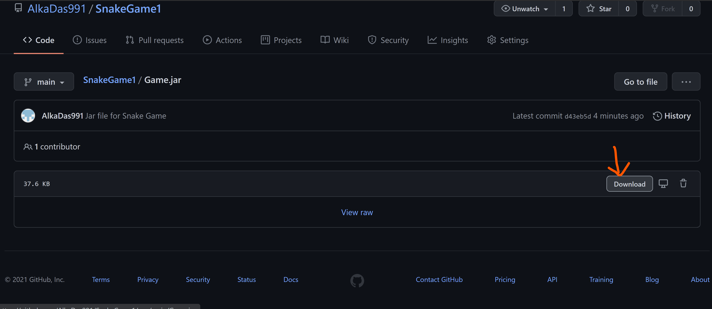

# SnakeGame1
* This is a GUI application based on the implementation of Java Swing  
* It has been built using JDK 14.0.2 version  
* To run it JDK 14.0.2 or more needs to be installed  
* JDK 14 Download Link:https://www.oracle.com/in/java/technologies/javase/jdk14-archive-downloads.html  
* Permanent Path setting for JDK https://www.javatpoint.com/how-to-set-path-in-java
* Good to Go, download the jar file as follows:
* 
* Double-Click and It runs😃
